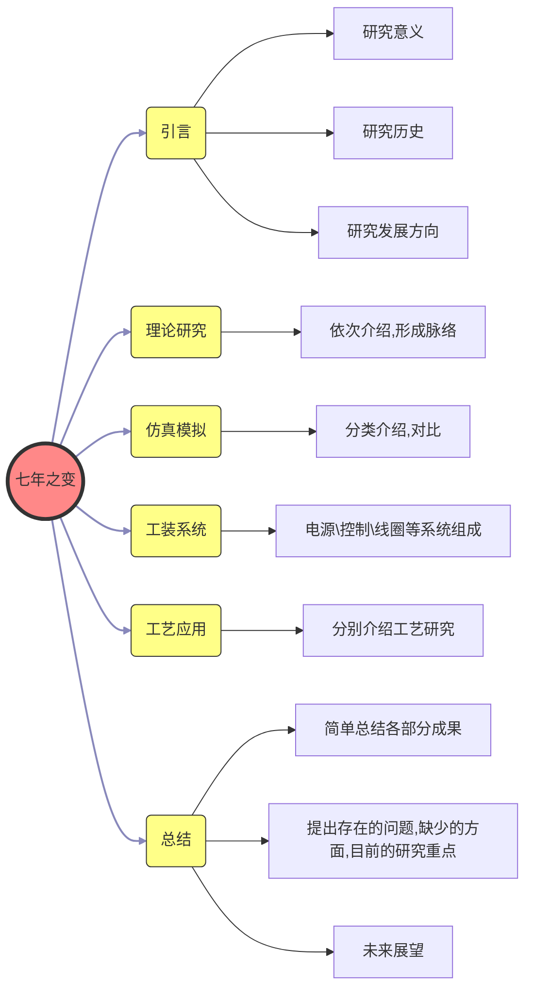
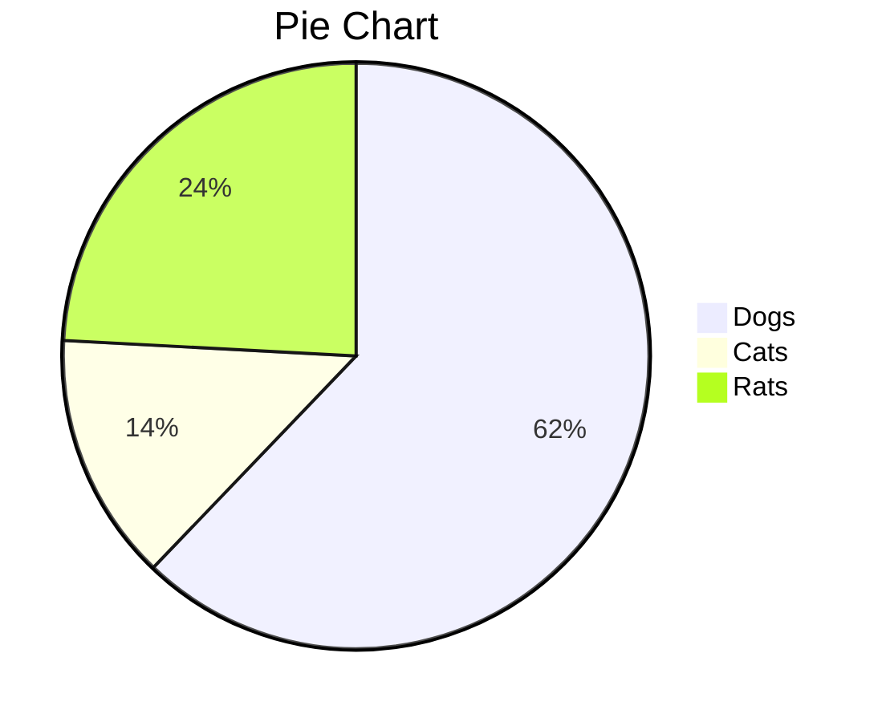

------

[TOC]

------

# Markdown语法

## 区域元素（区块元素、块级元素）

### 段落和断行

在Markdown中，一个段落用 *2个以上的空行* 来划分。而在Typora中，只需要一个空行（按下一次 <kbd>Return</kbd>）就可以开始新的一段。

按下 <kbd>Shift</kbd>+<kbd>Return</kbd> 可以创建一个*单行打断* 。大多数编译器（语法解析器）可能会忽略单行打断，为了避免这种情况，可以添加2个空格在单行末尾再进行单行打断；或者，插入<br/>。

**注**：单行打断是另起一行，而不是另起一段。

### 标题

在行的开头使用1-6个#号作为标题的标记，对应着1-6级标题。例如：


```markdown
# 这是一级标题

## 这是二级标题

###### 这是六级标题
```

在Typora中，#后面加上1个空格和标题内容后，输入回车，就可以看到效果。

### 引用

Markdown使用Email风格的 > 符号作为引用标记。使用如下：


```markdown
> # 引用的标题
> 引用的一段文字
>
> 引用的另一段文字
> > 引用中的引用，就是说，引用嵌套
```

### 列表

输入 * + - 符号，将会创建一个 *无序列表* 条目；输入1. 将会创建一个有序列表条目。例如：


```markdown
### 无序列表
* 语文
+ 数学
- 英语

### 有序列表
1. 姓名
2. 班级
3. 成绩
```

### 任务列表（活动列表、可选列表）

任务列表是可选列表，使用 - [ ] + 内容 创建一个可选任务列表。例如：


```markdown
- [ ] 一个未完成的任务列表条目
- [x] 一个完成的任务列表条目
- [ ] 任务列表条目可以使用鼠标勾选或取消
```

使用鼠标可以勾选条目前面的选择框，改变 *完成/未完成* 状态。

### 代码区块（代码区域）（围栏）

- 行内代码  可以在文本中间的插入的代码，使用 `code` 来插入到行中；*行内代码属于跨度元素*。
- 行间代码 显示在行与行之间的代码（多行代码）。在行的开头使用 ```+语言 来开始，末行使用```来结束，中间插入代码；*行间代码属于区块元素*。
- 也可以使用缩进（4个空格或一个制表符）来插入到行之间。

**注**：` 是反单引号<kbd>、~</kbd>输入


~~~c
这里`while(1)`表示无限循环。
```c
while(1)
{
    printf("这是一段C语言的多行代码")
}
~~~

下面的代码块中每行前面都有一个制表符（缩进）。
 while(1)
 {
 printf("这是一段C语言的多行代码")
 }


~~~csharp
Typora只支持GitHub风格的Markdown *围栏* （如上面代码区块周围的围栏），原始的Markdown代码块标记是不支持显示围栏的。

在Typora中，只需要输入 \`\`\`+<kbd>Return</kbd> 即可创建一个代码区块（围栏），也可在 \`\`\` 后面加上代码的语言。

### **数学区块（数学公式）**

**注意注意，重点来了哦**

数学公式的书写往往很麻烦，但是在Markdown中可以十分便捷地书写出来。Markdown采用MathJax语法进行简洁高效的数学公式编辑，呈现出$L^AT_EX$的数学表达形式。

#### 插入公式

* 行内公式，使用 \$公式\$ 的格式在行中插入公式
* 行间公式，多行公式使用 \$\$…\$\$ 格式在行间插入公式

例如：

``` markdown
这里使用 $\vec{a} \centerdot \vec{b} = |a||b|cos(\theta)$ 公式。
下面是行间公式：
$$
\mathbf{V}_1 \times \mathbf{V}_2 =  \begin{vmatrix}
\mathbf{i} & \mathbf{j} & \mathbf{k} \\
\frac{\partial X}{\partial u} &  \frac{\partial Y}{\partial u} & 0 \\
\frac{\partial X}{\partial v} &  \frac{\partial Y}{\partial v} & 0 \\
\end{vmatrix} \tag{1.2}
$$
~~~

（ *times 倍，乘以； boldface 黑体，粗体； fraction 分式； partial 部分的，偏颇* ）

显示结果：

这里使用 ) 公式。

下面是行间公式：
 

另外，使用 `\tag` 命令可以手动添加公式序号。

**而且！！**Typora中，在“偏好设置(preference)”，“数学公式”后面可以找到“自动添加序号”条目，勾选后重启Typora即可生效，实现数学公式自动添加序号。

开启自动添加序号后，每个 *行间公式* 会自动添加序号，但 *行内公式* 不会受到影响。当 *行间公式* 里有多个公式的时候，要使用[排列格式](####矩阵、排列（对齐）)，这时对齐区域内的每一个换行符号对应一个序号。

当使用 `\begin{align*} \end{align*}` 时，表示该区域公式不需编号。

#### 上下标

上标使用`^`，下标使用`_`。多个上下标字符使用小括号`{}`括起来。例如：


```markdown
$$
y = f_1^2(x^{e^2})
$$
```

$$
y = f_1^2(x^{e^2})
$$

如果符号两边都要加上下标，可以使用`\sideset`命令。`\sideset{1}{2}{3}` 参数1、2、3分别为左、右、中位置的符号，例如：

```markdown
$$
\sideset{^{左上}_{左下}}{^{右上}_{右下}}{中}
$$
```

$$
\sideset{^{左上}_{左下}}{^{右上}_{右下}}{中}
$$

#### 日语

漢かん字じ<ruby>漢<rt>かん</rt>字<rt>じ</rt></ruby>日本にほん语ご<ruby>日本<rt>にほん</rt>语<rt>ご</rt></ruby>

#### 矩阵、排列（对齐）

在书写公式的时候，我们通过排版使形式美观，内容分明。

- 使用 `\begin{keyword} \end{keyword}` 命令创建一个特定格式区域
- 关键词`keyword`有`align`、`matrix`、`vmatrix`、`bmatrix`、`pmatrix`等
- `\\`命令，换行，在任何区域都能使用
- `&`命令，对齐或分隔，具体作用在不同区域略有不同

例如：


```markdown
$$
    \left \{ 
        \begin{align}
            &
            \begin{bmatrix}
            a_1 & b_1 & c_1 \\
            a_2 & b_2 & c_2 \\
            a_3 & b_3 & c_3 
            \end{bmatrix}
            = 
            \begin{pmatrix}
            x_1 \\ x_2 \\ x_3
            \end{pmatrix}
            \begin{bmatrix}
            1 &   &   \\
              & 1 &   \\
              &   & 1 
            \end{bmatrix}
            \\
            &
            \begin{vmatrix}
            a_1 & b_1 & c_1 \\
            a_2 & b_2 & c_2 \\
            a_3 & b_3 & c_3 
            \end{vmatrix}
            = \lambda^3
             \\ 
             & W = U + V
        \end{align}
    \right.
    \tag{3}
$$
```

显示结果为：
 
 公式 (3) 是一个等式组或等式集合，这些等式都是以 `&` 对齐的，以 `\\` 分行的；其中又包括了各种矩阵样式，行列之间使用 `&` 与 `\\` 分隔的。

#### 运算符

数学公式中常见的运算符       可以直接使用键盘输入。

还有许多其他的运算符号，通过命令显示。常用命令，如下表：

|         命令         |                 名称                 |                             符号                             |                      示例                      |                             结果                             |
| :------------------: | :----------------------------------: | :----------------------------------------------------------: | :--------------------------------------------: | :----------------------------------------------------------: |
|       `\times`       |               乘 times               |     |                  `3 \times 5`                  |  |
|        `\div`        |              除 divide               |         |                   `3 \div 5`                   |  |
|   `\ge \geqslant`    |     大于或等于 greater or equal      |  |         `a \ge b \quad a \geqslant b`          |  |
|   `\le \leqslant`    |      小于或等于 lesser or equal      |  |          `b \le c \quad b \leqslant`           |  |
|        `\ne`         |           不等于 not equal           |           |                   `3 \ne 5`                    |  |
|       `\equiv`       |          必等于 equivalent           |     |                       -                        |                              -                               |
|      `\approx`       |         约等于 approximately         |   |                       -                        |                              -                               |
|      `\pm \mp`       |         加号 plus 减号 minus         |  |                       -                        |                              -                               |
|        `\sin`        |                 正弦                 |         |                       -                        |                              -                               |
|        `\cos`        |                 余弦                 |         |                       -                        |                              -                               |
|        `\tan`        |                 正切                 |         |                       -                        |                              -                               |
|        `\cot`        |                 余切                 |         |                       -                        |                              -                               |
|      `\arcsin`       |                反正弦                |   |                       -                        |                              -                               |
|      `\arctan`       |                反正切                |   |                       -                        |                              -                               |
|       `\sqrt`        |              开方 sqrt               |     |           `\sqrt 2 \quad \sqrt [n]3`           | ![\sqrt 2 \quad \sqrt [n]3](https://math.jianshu.com/math?formula=%5Csqrt%202%20%5Cquad%20%5Csqrt%20%5Bn%5D3) |
|        `\int`        |            积分 integral             |         |          `\int_0^\pi f(x) {\rm d} x`           | %20%7B%5Crm%20d%7D%20x) |
|      `\partial`      |              偏 partial              |  |        `\frac {\partial f}{\partial v}`        |  |
|       `\nabla`       |          矢量微分算子 nabla          |     |       `\bold A = \nabla \times \bold B}`       |  |
|        `\lim`        | 极限 limit 界限 limits 无穷 infinity |         | `\lim \limits_{n \to +\infty} \frac 1{n(n+1)}` | %7D) |
|        `\sum`        |            求和 summation            |         |      `\sum \limits_{i=1}^n \frac 1{i^2}`       |  |
|       `\prod`        |             累乘 product             |       |        `\prod \limits_{i=1}^n \frac 1n`        |  |
|        `\vec`        |             向量 vector              |   |                 `\vec {\rm u}`                 |  |
|       `\cdot`        |           中点 center dot            |  |             `\vec a \cdot \vec b`              |  |
|        `\cup`        |              （杯子）并              |         |           `\mathbf A \cup \mathbf B`           |  |
|      `\bigcup`       |             （大杯子）并             |   |         `\mathbf A \bigcup \mathbf B`          |  |
|        `\cap`        |              （帽子）交              |         |           `\mathbf A \cap \mathbf B`           |  |
|      `\bigcap`       |             （大帽子）交             |   |         `\mathbf A \bigcap \mathbf B`          |  |
|     `complement`     |            补 complement             |  |                `\complement_UA`                |  |
|        `\in`         |           属于，在其中 in            |           |                   `a \in A`                    |  |
|       `\notin`       |         不属于，不在 not in          |     |                  `b \notin A`                  |  |
|       `subset`       |             子集 subset              |   |                 `A \subset U`                  |  |
|      `subseteq`      |      子集或相等 subset or equal      |  |                `A \subseteq U`                 |  |
|      `\exists`       |             存在 exists              |   |                       -                        |                              -                               |
|      `\forall`       |           对于所有 for all           |   |                       -                        |                              -                               |
|        `\neg`        |           非,否定 negative           |         |                       -                        |                              -                               |
| `\empty \varnothing` |                  空                  |  |                       -                        |                              -                               |

#### 符号 & 字体

查看[符号字体使用规范](https://links.jianshu.com/go?to=http%3A%2F%2Fwww.stdresearch.com%2Fnewsinfo%2F904968.html)

|     命令      |                             显示                             |      命令       |                             显示                             |
| :-----------: | :----------------------------------------------------------: | :-------------: | :----------------------------------------------------------: |
|      `a`      |                 |       `A`       |                 |
|   `\varPhi`   |   | `\boldsymbol A` |  |
|    `\rm a`    |     |     `\rm A`     |     |
|  `\mathbf a`  |  |   `\mathbf A`   |  |
|   `\bold a`   |  |    `\bold A`    |  |
|  `\mathbb a`  |  |   `\mathbb A`   |  |
| `\mathcal a`  |  |  `\mathcal A`   |  |
| `\mathfrak a` |  |  `\mathfrak A`  |  |
| `\mathscr a`  |  |  `\mathscr A`   |  |

希腊字母，如下表：

|    命令    |                             显示                             |    命令    |                             显示                             |    命令    |                             显示                             |    命令    |                             显示                             |
| :--------: | :----------------------------------------------------------: | :--------: | :----------------------------------------------------------: | :--------: | :----------------------------------------------------------: | :--------: | :----------------------------------------------------------: |
|  `\alpha`  |     |  `\Alpha`  |     |  `\beta`   |       |  `\Beta`   |       |
|  `\gamma`  |     |  `\Gamma`  |     |  `\delta`  |     |  `\Delta`  |     |
| `\epsilon` |  | `\Epsilon` |  |  `\zeta`   |       |  `\Zeta`   |       |
|   `\eta`   |         |   `\Eta`   |         |  `\theta`  |     |  `\Theta`  |     |
|  `\iota`   |       |  `\Iota`   |       |  `\kappa`  |     |  `\Kappa`  |     |
| `\lambda`  |   | `\Lambda`  |   |   `\mu`    |           |   `\Mu`    |           |
|   `\nu`    |           |   `\Nu`    |           |   `\xi`    |           |   `\Xi`    |           |
| `\omicron` |  | `\Omicron` |  |   `\pi`    |           |   `\Pi`    |           |
|   `\rho`   |         |   `\Rho`   |         |  `\sigma`  |     |  `\Sigma`  |     |
|   `\tau`   |         |   `\Tau`   |         | `\upsilon` |  | `\Upsilon` |  |
|   `\phi`   |         |   `\Phi`   |         |   `\chi`   |         |   `\Chi`   |         |
|   `\psi`   |         |   `\Psi`   |         |  `\omega`  |     |  `\Omega`  |     |

可见，若要得到大写的希腊字母，只需将其命令英文名 *首字母大写* 即可。

部分字母有专用的 *变量* 形式，在原命令前面加 `\var` 即可：

|   原命令   |     变量      |                             显示                             |
| :--------: | :-----------: | :----------------------------------------------------------: |
| `\epsilon` | `\varepsilon` |  |
|  `\theta`  |  `\vartheta`  |  |
|   `\rho`   |   `\varrho`   |  |
|  `\sigma`  |  `\varsigma`  |  |
|   `\phi`   |   `\varphi`   |  |

#### 其他字符

|                             符号                             |      名称      |         命令          |                             符号                             |      名称      |        命令        |
| :----------------------------------------------------------: | :------------: | :-------------------: | :----------------------------------------------------------: | :------------: | :----------------: |
|  |    顶右箭头    | `\overrightarrow{AB}` |  |    顶左箭头    | `\overleftarrow A` |
|  |       冒       |       `\hat{a}`       |  |      横线      |    `\overline`     |
|  |     右箭头     |     `\rightarrow`     |  |     右推出     |   `\Rightarrow`    |
|  |     左箭头     |     `\leftarrow`      |  |     左推出     |    `\Leftarrow`    |
|  |    双向箭头    |   `\leftrightarrow`   |  |     等价于     | `\Leftrightarrow`  |
|  |    长右箭头    |   `\longrightarrow`   |  |    长右推出    | `\Longrightarrow`  |
|  |    长左箭头    |   `\longleftarrow`    |  |    长左推出    |  `\Longleftarrow`  |
|           |       π        |          \pi          |  |      间隔      |        `~`         |
|  |     三角形     |      `\triangle`      |       |      圆点      |      `\odot`       |
|     |       角       |       `\angle`        |       |      垂直      |      `\perp`       |
|  |    底大括号    | `\underbrace{111}_3`  |     |      无穷      |      `\infty`      |
|  |      因为      |      `\because`       |  |      所以      |    `\therefore`    |
|  |    居中的点    |     `\centerdot`      |     | 省略号（中间） |      `\cdots`      |
|   |      大点      |       `\bullet`       |       | 省略号（底部） |      `\dots`       |
|     | 省略号（下降） |       `\ddots`        |     | 省略号（垂直） |      `\vdots`      |
|         |     波浪号     |        `\sim`         |  |      波浪      |      `\tilde`      |
|  |     宽波浪     |     `\widetilde`      |  |      双点      |      `\ddot`       |

**注**：正交 垂直 perpendicular，斜的，对角的 diagonal，竖直的 vertical

#### Detexify工具

Detexify工具能在浏览器中访问并使用，可以识别用户在画图区域画出的符号，并快速匹配  中相似的符号，从而十分方便符号命令的查找。

#### 参考链接

> [Detexify工具](https://links.jianshu.com/go?to=http%3A%2F%2Fdetexify.kirelabs.org%2Fclassify.html)
>
> [MathJax的符号文档](https://links.jianshu.com/go?to=http%3A%2F%2Fdocs.mathjax.org%2Fen%2Flatest%2Ftex.html%23supported-latex-commands).
>
> 数学公式部分内容的主要[参考文章](https://www.jianshu.com/p/c2814458dbfe) 简单易懂！但是积分、极限、累加、累乘的上下限命令有误，这里已经改正。
>
>  数学公式中[常用命令](https://links.jianshu.com/go?to=https%3A%2F%2Fblog.csdn.net%2Fwhuhan2013%2Farticle%2Fdetails%2F50782149)

### 图表

#### 表格

Markdown可以通过字符绘制表格。

使用 `|` 来分隔表的列，回车换行后将进入新的一行。
 第一行部分为表头，第二行使用 `---` 来分隔表头和接下来的内容，之后的行继续按照格式绘制。
 第二行可以使用 `|:---|` `|:--:|` `|---:|` 来规定所在列字符的位置，分别为靠左，居中，靠右。

其格式例如：


```markdown
| 序号 | 名称 | 特点 | 爱好 |
|:---:|:-----|------|-----:|
| 1   | 人类 | 说话 | 利益 |
| 2   | 狗   | 忠诚  | 肉   |
| 3   | 猪   | 胖    | 睡觉 |
```

显示结果：

| 序号 | 名称 | 特点 | 爱好 |
| :--: | :--- | ---- | ---: |
|  1   | 人类 | 说话 | 利益 |
|  2   | 狗   | 忠诚 |   肉 |
|  3   | 猪   | 胖   | 睡觉 |

在Typora中，只需要输入表格第一行，就可以生成表格；也可使用 <kbd>Ctrl</kbd>+<kbd>T</kbd> 快捷键创建一个表格。

#### 标准流程图(flow语法)

**标准流程图**是用 flow 语法。

定义元素：`元素ID=>元素类型: 元素内容`

- **冒号后面有一个空格**
- 元素ID和内容可以自定义
- 元素类型是固定几种：`start`、`inputoutput`、`condition`、`operation`、`end`、`subroutine`

连接元素：`元素ID1->元素ID2(top)->元素ID3 元素ID2(yes,right)->元素ID4`

- 如，`1->2`连接元素1和2，**三者中间不能有空格**
- 在某元素ID后面加上`(top)(bottom)(left)(right)`，为其指定出线位置
- 在条件元素后面加`(yes)(no)`，为其指定出线条件；条件元素连线只有**向下**、**向右**两个方向


~~~markdown
```flow
startID=>start: 开始框
inputoutputID=>inputoutput: 输入输出框
operationID=>operation: 操作框
conditionID=>condition: 条件框
conditionID2=>condition: 条件框2
subroutineID=>subroutine: 子流程
endID=>end: 结束框

startID->inputoutputID(left)->operationID->conditionID
conditionID(no)->subroutineID
conditionID(yes,right)->conditionID2(yes)->endID
conditionID2(no)->conditionID
~~~


~~~php
在markdown中，使用 *代码区块* 编写，将语言为`flow`即可渲染出以下效果：

```flow
startID=>start: 开始框
inputoutputID=>inputoutput: 输入输出框
operationID=>operation: 操作框
conditionID=>condition: 条件框
conditionID2=>condition: 条件框2
subroutineID=>subroutine: 子流程
endID=>end: 结束框

startID->inputoutputID(left)->operationID->conditionID
conditionID(no)->subroutineID
conditionID(yes,right)->conditionID2(yes)->endID
conditionID2(no)->conditionID
~~~

```flow
startID=>start: 开始框
inputoutputID=>inputoutput: 输入输出框
operationID=>operation: 操作框
conditionID=>condition: 条件框
conditionID2=>condition: 条件框2
subroutineID=>subroutine: 子流程
endID=>end: 结束框

startID->inputoutputID(left)->operationID->conditionID
conditionID(no)->subroutineID
conditionID(yes,right)->conditionID2(yes)->endID
conditionID2(no)->conditionID
```

#### 流程图(mermaid语法)

在mermaid中，使用`graph 流程图方向`关键词开始绘图。


~~~markdown
```mermaid
graph TB
~~~


~~~ruby
流程图方向有下面几个值：

- `TB`(`TD`) 从上至下
- `BT` 从下至上
- `RL` 从右至左
- `LR` 从左至右

基本图形：（**id与符号之间不能有空格**）

- `id[我是矩形]` （默认）
- `id(我是圆角矩形)`
- `id>我是不对称矩形]`
- `id{我是菱形}`
- `id((我是圆形))`

连接线：

- `a--b` 实线连接
- `a-->b` 实线箭头指向
- `a-.-b` 虚线连接
- `a-.->b` 虚线箭头指向 
- `a==>b` 粗线箭头指向
- `a--Y---b` 标注Y的实线连接
- `a–-Y-->b` 标注Y的实线箭头指向
- `a-.Y.->b` 标Y的虚线箭头指向
- `a==Y==>b` 标注Y的粗线箭头指向

子流程图：

使用`subgraph 标题 \\....\\ end`创建一个带标题的子流程图区域。

```markdown
```mermaid
graph TB
    c1 -.-> a2
    subgraph title1
    a1 --> a2
    end
    subgraph title2
    b1 --独立--> b2
    end
~~~


~~~rust
效果像这样：

```mermaid
graph TB
    c1 -.-> a2
    subgraph title1
    a1 --> a2
    end
    subgraph title2
    b1 --独立--> b2
    end
~~~

```mermaid
graph TB
    c1 -.-> a2
    subgraph title1
    a1 --> a2
    end
    subgraph title2
    b1 --独立--> b2
    end
```

自定义样式，还可以使Font Awesome图标（没有看到效果，略了）


~~~markdown
```mermaid
graph LR
    id1(stat)-->id2(stop)
    id3>不规则矩形]-->id4((圆))
    style id1 fill:#f9f,stroke:#333,stroke-width:4px,fill-opacity:0.5 %% 定义框样式
    style id2 fill:#ccf,stroke:#f66,stroke-width:2px,stroke-dasharray: 10,5
    linkStyle 0 stroke:#0ff,stroke-width:2px %% 定义连接线样式
    linkStyle 1 stroke:#0f0,stroke-width:2px
    classDef classname fill:#f9f,stroke:#0ff %% 定义样式类
    class id3,id4 classname%% 应用样式
~~~


~~~css
效果很漂亮哦：

```mermaid
graph LR
    id1(stat)-->id2(stop)
    id3>不规则矩形]-->id4((圆))
    style id1 fill:#f9f,stroke:#333,stroke-width:4px,fill-opacity:0.5 %% 定义框样式
    style id2 fill:#ccf,stroke:#f66,stroke-width:2px,stroke-dasharray: 10,5
    linkStyle 0 stroke:#0ff,stroke-width:2px %% 定义连接线样式
    linkStyle 1 stroke:#0f0,stroke-width:2px
    classDef classname fill:#f9f,stroke:#0ff %% 定义样式类
    class id3,id4 classname%% 应用样式
~~~

```mermaid
graph LR
    id1(stat)-->id2(stop)
    id3>不规则矩形]-->id4((圆))
    style id1 fill:#f9f,stroke:#333,stroke-width:4px,fill-opacity:0.5 %% 定义框样式
    style id2 fill:#ccf,stroke:#f66,stroke-width:2px,stroke-dasharray: 10,5
    linkStyle 0 stroke:#0ff,stroke-width:2px %% 定义连接线样式
    linkStyle 1 stroke:#0f0,stroke-width:2px
    classDef classname fill:#f9f,stroke:#0ff %% 定义样式类
    class id3,id4 classname%% 应用样式
```

#### 流程图实现的思维导图(mind map)

思维导图，又称脑图。思维导图运用图文并重的技巧，把各级主题的关系用相互隶属与相关的层级图表现出来，把主题关键词与图像、颜色等建立记忆链接。
 适用于记录会议、讨论等以思路发展线索的内容。

目前 markdown 还没有实现思维导图的模块，但是可以利用流程图实现简单的绘制。

如这里对某文章论述思路的笔记：


```markdown
graph LR
A((七年之变)) --> 1(引言)
A --> 2(理论研究)
A --> 3(仿真模拟)
A --> 4(工装系统)
A --> 5(工艺应用)
A --> 6(总结)
linkStyle 0,1,2,3,4,5 stroke:#88d,stroke-width:2px

1 --> 研究意义
1 --> 研究历史
1 --> 研究发展方向

2 --> 依次介绍,形成脉络
3 --> 分类介绍,对比
4 --> 电源\控制\线圈等系统组成
5 --> 分别介绍工艺研究

6 --> 简单总结各部分成果
6 --> 提出存在的问题,缺少的方面,目前的研究重点
6 --> 未来展望

classDef topic fill:#f88,stroke:#333,stroke-width:4px 
classDef key fill:#ff8,stroke:#333

class A topic
class 1,2,3,4,5,6 key
```




#### 标准时序图(sequence语法)

使用`sequence`语法。

标题`title:我是标题`

定义参与人：`participant A` （也可以不定义，交互时会自动创建对象），`participant Blablabla as s`可以**指定别名**

交互格式：`A-B:交互内容` A是发起者，B是接受者，**不能颠倒**；- 是连接符；**必须有冒号**，即使交互内容为空

连接符：

- `-`或`->` 实线指向
- `--`或`-->`虚线指向
- `->>`或`-->>` 实线或虚线空心箭头指向

注释：`note left/right of A:在A右或左注释`


~~~markdown
```sequence
title:标题
participant A
participant B as s

note left of A:智能算法
A-s:
note right of A:推送消息
s--C:giaoooo
note right of s:发出呼唤
C-->>s:Giao!
note left of C:回应
C--C:giao!giao!
note right of C:意犹未尽
s->>A:
note left of s:点赞
note left of A:收到反馈
~~~


~~~swift
在markdown使用代码区块完成绘制：

```sequence
title:标题
participant A
participant Bill as s

note left of A:智能算法
A-s:
note right of A:推送消息
s--C:giaoooo
note right of s:发出呼唤
C-->>s:Giao!
note left of C:回应
C--C:giao!giao!
note right of C:意犹未尽
s->>A:
note left of s:点赞
note left of A:收到反馈
~~~

```sequence
title:标题
participant A
participant Bill as s

note left of A:智能算法
A-s:
note right of A:推送消息
s--C:giaoooo
note right of s:发出呼唤
C-->>s:Giao!
note left of C:回应
C--C:giao!giao!
note right of C:意犹未尽
s->>A:
note left of s:点赞
note left of A:收到反馈
```

#### 时序图(mermaid语法)

在mermaid中使用`sequenceDiagram`开始绘制时序图。


~~~markdown
```mermaid
sequenceDiagram
~~~


~~~go
标题：`title: 标题` 

定义参与人：`participant Alice`；可以使用别名`participant Alice as A`；也可以不声明，交互的时候会创建

消息交互：

- `A->B: ` 无箭头实线
- `A-->B: ` 无箭头虚线
- `A->>B: ` 实线箭头
- `A-->>B: ` 虚线箭头
- `A-x B: ` 有箭头实线+叉
- `A--x B: ` 有箭头虚线+叉
- 消息格式后面一定要有`:`和内容（空格）

活动期：

- `active A` 激活 A
- `deactive A` 停用 A
- 使用更方便的`+/-`写法：激活 B `A->>+B`；停用 B `A->>-B`
- 活动期可嵌套

注释：

- `note of left/right of A: 注释内容` 在 A 的时序线左或右注释内容
- `note over A/A,B: 注释内容` 在 A 或 A 和 B 的时序线上注释

循环：

```markdown
loop 循环说明
    时序事件
end
~~~

选择：


```markdown
alt 选择描述1
    时序事件1
else 选择描述2
    时序事件2
end
opt 其他情况描述
    时序事件3
end
```


```mermaid
sequenceDiagram
    title:标题
    participant A as Alice
    participant B
    
    note over A: 智能算法
    A->B:小阿giao
    activate B
    note right of A:推送消息
    B-->+C:giaoooo
    note right of B:发出呼唤
    C-->>-B:Giao!
    note left of C:回应
    loop 意犹未尽
    C--x C:giao!giao!
    end
    B->>A: 
    deactivate B
    note left of B:点赞
    note left of A:收到反馈
    alt 正反馈
    A->>B: 同类消息
    else 负反馈
    A->>B: 减少同类消息
    end
    opt 其他情况
    A-->B:不改变推送策略
    end
```

#### 甘特图(gantt)

甘特图是用来展示项目任务计划与进展的图，使用 mermaid 语法绘制甘特图。


~~~markdown
```mermaid
gantt
~~~


~~~ruby
标题：`title 标题` 

日期格式：`dateFormat 日期格式` 

部分：`section 部分名` 

任务：`任务名: 强调, 状态, 别名, 开始日期, 截止日期或持续时间` 

- 任务名：创建一个任务，并赋予名称
- 强调：`crit` ；无，不强调
- 状态：`done`，`active`，无 分别表示任务已完成、活动、未完成的状态
- 别名：给任务取个别名，用于其他任务的`after 别名`；可以不取别名
- 开始日期：`yyyy-mm-dd` 年-月-日；`after xx` 在某任务后；无，默认在前一个任务之后
- 截止日期或持续时间：`yyyy-mm-dd` 年-月-日；持续时间 `1d`，`1h`，`1s` 

```markdown
```mermaid
gantt
title 这是个练习
dateFormat YYYY-MM-DD
section 设计
第一任务:done, 1, 2019-09-06, 2019-09-09
第二任务:crit, active, 3d
第三任务:active, after 1, 1d
section 开发
第一任务:done, 2019-09-08, 36h
第二任务:active, 2d
第三任务: 1d
~~~


~~~css
效果如下：
```mermaid
gantt
title 这是个练习
dateFormat YYYY-MM-DD
section 设计
第一任务:done, 1, 2019-09-06, 2019-09-09
第二任务:crit, active, 3d
第三任务:active, after 1, 1d
section 开发
第一任务:done, 2019-09-08, 36h
第二任务:active, 2d
第三任务: 1d
~~~

```mermaid
gantt
title 这是个练习
dateFormat YYYY-MM-DD
section 设计
第一任务:done, 1, 2019-09-06, 2019-09-09
第二任务:crit, active, 3d
第三任务:active, after 1, 1d
section 开发
第一任务:done, 2019-09-08, 36h
第二任务:active, 2d
第三任务: 1d
```

### 脚注

使用 `[^foodnote]` 添加脚注：


```markdown
这是一个脚注[^1]
[^1]:脚注内容在这里编辑，此条文本不会显示
```

显示结果：

这是一个脚注[[1\]](#fn1)

### 水平线

Horizontal Rules 水平线

输入 `***` 或 `---` 在空行，即可画出一条水平线。水平线如下：

------

### [YAML Front Matter](https://links.jianshu.com/go?to=http%3A%2F%2Fjekyllrb.com%2Fdocs%2Ffrontmatter%2F)

YAML是YAML Ain't Markup Language递归缩写，即YAML不是标记语言的意思。

YAML是便于人阅读基于unicode编码的各种语言的序列号标准。它的用途广泛，用于配置文件，日志文件，跨语言数据共享，对象持久化，复杂的数据结构。

具有以下特性：

- 易于阅读，不是语言，是一种标准
- YAML便于在各种语言之间移植，支持向其他语言环境拓展
- 直观的能够被电脑识别的数据序列化格式
- 容易和脚本语言交互，用来表达资料序列

Front Matter 前言；前文部分。

在YAML Front Matter中可以表明文章的信息（方便各种语言获取），设置一些环境中的格式，定义一些变量，甚至自定义一些变量（方便在不同语言环境下，达到想要的效果）。

在Typora中，输入 `---` 在文章的顶端，即可创建一个元数据区块(matedata block)，在其中插入YAML。

### 目录（内容表）

Table of Contents，简称(TOC)。

输入 `[TOC]` 并按下回车，即可生成一个目录。它会根据标题自动更新。

## 跨度元素

跨度元素输入后将被解析和联接。下面是各种跨度元素的语法。

### 链接

Markdown支持2种链接：行内链接接与参考链接。

*行内链接* 可以在URL后面设置链接的标题，也可以不设置。例如：


```markdown
这是一个[行内链接](https://www.cnblogs.com/fhkankan/p/8082351.html/"参考文章")，且带有标题。
这个[链接](https://www.cnblogs.com/fhkankan/p/8082351.html)就没有带标题。
```

显示结果为：

这是一个[行内链接](https://links.jianshu.com/go?to=https%3A%2F%2Fwww.cnblogs.com%2Ffhkankan%2Fp%2F8082351.html%2F%22%E5%8F%82%E8%80%83%E6%96%87%E7%AB%A0%22)，且带有标题。
 这个[链接](https://links.jianshu.com/go?to=https%3A%2F%2Fwww.cnblogs.com%2Ffhkankan%2Fp%2F8082351.html)就没有带标题。

*内部链接* 也是行内链接，它用来在文章内进行跳转，即通过为标题设置超链接。例如：


```markdown
转至[区域元素](#区域元素（区块元素、块级元素）)。 注意，链接中的标题**。
```

结果显示：

转至[区域元素](#区域元素（区块元素、块级元素）)。注意，链接中的标题**#号与标题之间没有空格**。

*参考链接* 是在链接后添加一个身份标签，然后再对其补充链接和标题。例如：


```markdown
这是一个[参考链接][id]，使用了id标签。
[id]:https://www.runoob.com/markdown/md-tutorial.html/"这里是标题-Markdown菜鸟教程"
有时，也会使用空标签，比如[这样][]。
[这样]:https://www.runoob.com/markdown/md-tutorial.html/"这里是标题-Markdown菜鸟教程"
```

显示结果：

这是一个[参考链接][id]，使用了id标签。

[id]: https://www.runoob.com/markdown/md-tutorial.html/(https://links.jianshu.com/go?to=https%3A%2F%2Fwww.runoob.com%2Fmarkdown%2Fmd-tutorial.html%2F)"这里是标题-Markdown菜鸟教程"

 有时，也会使用空标签，比如[这样](https://links.jianshu.com/go?to=https%3A%2F%2Fwww.runoob.com%2Fmarkdown%2Fmd-tutorial.html%2F%22%E8%BF%99%E9%87%8C%E6%98%AF%E6%A0%87%E9%A2%98-Markdown%E8%8F%9C%E9%B8%9F%E6%95%99%E7%A8%8B%22)。

### URLs

Uniform Resource Locator：统一资源定位地址，即网址。

Typora允许插入URLs作为链接，使用 `<` 和 `>` 将链接括起来。

`<i@typora.io>` 显示为 [i@typora.io](https://links.jianshu.com/go?to=mailto%3Ai@typora.io)

Typora将会自动连接标准的网址，比如：<[www.google.com](https://links.jianshu.com/go?to=http%3A%2F%2Fwww.google.com)>

### 图片

Markdown支持插入图片，格式如下：


```markdown
[图片上传失败...(image-ebb2ba-1622002024605)]

[图片上传失败...(image-8b6f2c-1622002024606)]
```

中扩号里是图片名称（可不填），小括号里是图片路径，可以是本地路径，也可以是图片的URL，可以是绝对路径，也可以是相对路径。

显示为（我已上传图片了，下图引用自图片的url链接）：


喵帕斯


另外，可直接通过 *拖拽* 的方式从文件夹或者浏览器中来插入图片。如果从浏览器中拖拽过来，将会自动在所编辑的文档路径下添加该图片文件。

在Typora中，如果使用Markdown来构建网站，可以指定一个URL前缀在YAML Front Matters中，用来预览本地计算机中的图片，即使用 `typora-root-url` 属性。例如，在YAML前置内容中输入 `typora-root-url:E:/Potplayer/Capture/` ，然后在文中输入 `` ，等同于输入 `` 。

你可以查看更多[详情](https://links.jianshu.com/go?to=https%3A%2F%2Fsupport.typora.io%2FImages%2F)。

### 强调

Markdown中把星号 `*` 和下划线 `_` 作为强调标记。使用 `*` 或 `_` 夹住需要强调的文本即可，等同于HTML中的 `<em>` 标签。
 例如：


```markdown
使用 *单星号* 或者 _单下划线_ 标记强调。
```

显示为：

使用 *单星号* 或者 *单下划线* 标记强调。

如果是短语中、单词间的下划线将会被忽略，比如：nameless_zhang_is_a_zai。

想在文本中显示星号和下划线，要在符号前使用 `\` 来转义。

### 加粗

使用双星号或者双下划线括住的文本将显示为加粗。例如：


```markdown
**Duang~**加了特效。
```

显示为：

**Duang~**加了特效。

### 代码

属于*跨度元素* 的是行内代码。

在行内插入代码使用<kbd>`~</kbd>按键产生的点，将代码括起来。例如：


```markdown
这里是一个行内代码`while(1);`。
```

显示为：

这里是一个行内代码`while(1);`。

### 横穿线（删除线）

GFM(Github Flavored Markdown)添加了删除线语法，在标准Markdown中是没有的。

`~~看不见我~~` 显示为：~~看不见我~~。

### 下划线

下划线使用HTML语法实现：
 `<u>下划线</u>` 显示为  <u>下划线</u>。

### Emoji:smile:

**绘文字**（日语：絵文字/えもじ *emoji*）。也叫颜文字，小黄脸等。

2014年8月，牛津词典在线版（Oxford Dictionary Online）把“Emoji”添加到新词汇中，这也意味着它已经变成一个正式词汇。这种表情符号开始席卷全球，目前emoji已被大多数现代计算机系统所兼容的[Unicode](https://links.jianshu.com/go?to=https%3A%2F%2Fbaike.baidu.com%2Fitem%2FUnicode)编码[采纳](https://links.jianshu.com/go?to=https%3A%2F%2Fbaike.baidu.com%2Fitem%2F%E9%87%87%E7%BA%B3%2F10617594)，普遍应用于各种手机短信和社交网络中。

输入Emoji使用冒号括住表情名称，例 `:joy:` 显示为 :joy:。

不知道Emoji字符名称？

- [Emoji字符表](https://links.jianshu.com/go?to=https%3A%2F%2Fwww.webfx.com%2Ftools%2Femoji-cheat-sheet%2F)
- [Emoji表情大全](https://links.jianshu.com/go?to=http%3A%2F%2Femojihomepage.com%2F)

苹果公司最早将Emoji加入系统和输入法中，所以在macOS系统中可以直接输入UTF-8Emoji字符。

### 行内公式

公式中的行内公式属于跨度元素。

要使用该语法，先在“偏好” -> “Markdown”标签中进行设置。

Markdown中是使用  的公式语法，简单强大。例如：
 抛物线的公式用 `$y = x^2$` 表示，显示。

### 下标

要使用该语法，先在“偏好” -> “Markdown”标签中进行设置。

使用格式，例如：`H~2~O` 会显示如同 。

### 上标

要使用该语法，先在“偏好” -> “Markdown”标签中进行设置。

使用格式，例如： `X^2^` 会显示如同  。


### 高亮

要使用该语法，先在“偏好” -> “Markdown”标签中进行设置。

使用格式，例如： `==bing!==` 显示为 ==bing!==。

==文本高亮==，__加粗__，*斜体*，==***斜体高亮加粗***==，~~删除线~~，<u>下划线</u>。`<font>`标签被我用于一款小标签样式（[小康](https://www.antmoe.com/posts/3b43914f/)）：<font>红色小标签</font>，可以通过设置`background-color`属性控制背景色，如：<font style="background-color:#8bc34a">绿色小标签</font>，为了方便，我提供了五种预定义的颜色（包括前面的红色、<span alt="glow">绿色</span>）：<font title="blue">蓝色小标签</font>、<font title="yellow">黄色小标签</font>、<font title="gray">灰色小标签</font>。一些强调型格式：<span alt="underline">下划线</span>、<span alt="emp">着重号</span>、<span alt="wavy">波浪线</span>。其他：<span alt="hide">隐藏文本</span>，<span alt="hollow">空心字</span>，<span alt="blink">字体闪烁</span>

<span alt="rainbow">彩虹变换字体特效</span>（嫖自[黑石大佬](https://www.heson10.com/posts/21347.html)🙇‍♀️），<span alt="modern">欢迎光临</span>（嫖自[QinXS](https://7bxing.com/friends/)🙇‍♀️），<span alt="shake">抖音字效</span>（嫖自[NyKee](https://www.nykee.cn/)🙇‍♀️）

## HTML

HTML是超文本标记语言。

Markdown完全兼容超文本标记语言，这也是它广为流行的原因之一。于是，**可以使用HTML标签去制定Markdown没有支持的样式！！**例如：


```markdown
<span style = "color:red">这就会是红色了</span>。
```

显示为：

<span style = "color:red">这就会是红色了</span>。

尽管很简单，然而，目前我还没学HTML语言。其实，如果只学样式设置的话，应该很快就能掌握。

### 嵌入内容

一些网站支持iframe内嵌框架代码。HTML中的iframe元素会创建包含另一个网页的内联框架，使用其属性可以改变其显示样式。Typora支持iframe元素。

| 属性         | 值                                                           | 描述                                               |
| :----------- | :----------------------------------------------------------- | :------------------------------------------------- |
| frameborder  | 1 0 yes no                                                   | HTML5 不支持。规定是否显示 `<iframe>` 周围的边框。 |
| border       | pixels                                                       | 规定`<iframe>`的边框宽度。                         |
| framespacing | pixels                                                       | 规定`<iframe>`的边框宽度，与border同。             |
| height       | pixels                                                       | 规定 `<iframe>` 的高度。                           |
| name         | name                                                         | 规定 `<iframe>` 的名称。                           |
| sandbox      | allow-forms  allow-same-origin  allow-scripts  allow-top-navigation | 对 `<iframe>` 的内容定义一系列额外的限制。         |
| scrolling    | yes   no   auto                                              | HTML5 不支持。规定是否在 `<iframe>` 中显示滚动条。 |
| seamless     | seamless                                                     | 规定 `<iframe>` 看起来像是父文档中的一部分。       |
| src          | URL                                                          | 规定在 `<iframe>` 中显示的文档的 URL。             |
| width        | pixels                                                       | 规定 `<iframe>` 的宽度。                           |

例如：

```markdown
<iframe height = '600' src="//player.bilibili.com/player.html?aid=ca9f716308a47df5608c11a05c14f71a" scrolling="no" border="0" frameborder="no" framespacing="0" allowfullscreen="true"> </iframe>
```


<iframe height = '600' src="//player.bilibili.com/player.html?isOutside=true&aid=53851218&bvid=BV1j4411W7F7&cid=94198756&p=1" scrolling="no" border="0" frameborder="no" framespacing="0" allowfullscreen="true" autoplay = "false" ></iframe>

顺便，在B站视频分享栏的下拉菜单中可以找到“内嵌代码”，可以直接复制使用！！！**哔哩哔哩\* (゜-゜)つロ 干杯~**

### 视频

使用 `<video>` 标签可以嵌入视频。直接**拖拽**到Typora中将会自动生成一个基本的HTML代码，但是其他属性还需适当设置。

| 属性     | 值                 | 描述                                                         |
| :------- | :----------------- | :----------------------------------------------------------- |
| autoplay | autoplay           | 如果出现该属性，则视频在就绪后马上播放。                     |
| controls | controls           | 如果出现该属性，则向用户显示控件，比如播放按钮。             |
| height   | pixels             | 设置视频播放器的高度。                                       |
| loop     | loop               | 如果出现该属性，则当媒介文件完成播放后再次开始播放。         |
| muted    | muted              | 如果出现该属性，视频的音频输出为静音。                       |
| poster   | URL                | 规定视频正在下载时显示的图像，直到用户点击播放按钮。         |
| preload  | auto metadata none | 如果出现该属性，则视频在页面加载时进行加载，并预备播放。如果使用 "autoplay"，则忽略该属性。 |
| src      | URL                | 要播放的视频的 URL。                                         |
| width    | pixels             | 设置视频播放器的宽度。                                       |

例如：


```markdown
<video src = "E:\Potplayer\Capture\极地特快之冰谷漂移.mp4" />
```

显示为：（这是我的本地文件，所以不能显示；您可以将代码中的路径替换成您本地的视频文件路径）

<video src = "E:\Potplayer\Capture\极地特快之冰谷漂移.mp4" />

### 音频

使用 `<audio>` 标签可以嵌入音频。直接**拖拽**到Typora中将会自动生成一个基本的HTML代码，但是其他属性还需适当设置。

| 属性     | 值       | 描述                                                         |
| :------- | :------- | :----------------------------------------------------------- |
| autoplay | autoplay | 如果出现该属性，则音频在就绪后马上播放。                     |
| controls | controls | 如果出现该属性，则向用户显示控件，比如播放按钮。             |
| loop     | loop     | 如果出现该属性，则每当音频结束时重新开始播放。               |
| preload  | preload  | 如果出现该属性，则音频在页面加载时进行加载，并预备播放。如果使用 "autoplay"，则忽略该属性。 |
| src      | url      | 要播放的音频的 URL。                                         |


```markdown
<audio controls src="E:\酷狗\音乐\つじあやの - 風になる.mp3"> 幻化成风 </audio>
```

显示为：（这是我的本地文件，所以不能显示；您可以将代码中的路径替换成您本地的音频文件路径）

<audio controls src="C:\Users\李坤\Music\坂本龙一 (さかもと りゅういち) _ Jaques Morelenbaum _ Judy Kang - Merry Christmas Mr_ Lawrence (劳伦斯先生圣诞快乐_圣诞快乐，劳伦斯先生)_EM.flac"> 幻化成风 </audio>

> 可以将`<audio>`音频包裹在`<center></center>`中居中显示

插入网易云的外链播放器（`<iframe>`，可嵌入油管等平台视频）：

<iframe frameborder="no" border="0" marginwidth="0" marginheight="0" width=330 height=86 src="https://music.163.com/outchain/player?type=2&id=1397691026&auto=1&height=66"></iframe>
<iframe frameborder="no" border="0" marginwidth="0" marginheight="0" width=330 height=86 src="//music.163.com/outchain/player?type=2&id=1859897031&auto=1&height=66"></iframe>

<iframe frameborder="no" border="0" marginwidth="0" marginheight="0" width=330 height=86 src="//music.163.com/outchain/player?type=2&id=2128787688&auto=1&height=66"></iframe>

### 其他HTML语法支持

你可以在[这里](https://support.typora.io/HTML/)找到更多神奇的HTML用法。

###   图表



[在线Mermaid编辑器](https://mermaid.live/edit)、[幕布脑图](https://mubu.com/home)（MD文档以OPML格式导出然后借助幕布转换为思维脑图）

> 更多绘图参考[官方文档](https://support.typora.io/Draw-Diagrams-With-Markdown/)


<center><svg xmlns="http://www.w3.org/2000/svg" xmlns:xlink="http://www.w3.org/1999/xlink" version="1.1" height="400px" viewBox="-0.5 -0.5 1071 773" content="&lt;mxfile host=&quot;app.diagrams.net&quot; modified=&quot;2021-11-15T07:08:52.373Z&quot; agent=&quot;5.0 (Windows NT 10.0; WOW64) AppleWebKit/537.36 (KHTML, like Gecko) Chrome/86.0.4240.198 Safari/537.36&quot; etag=&quot;aOnjZZMrixLFimZz001-&quot; version=&quot;15.7.3&quot; type=&quot;google&quot;&gt;&lt;diagram id=&quot;07fea595-8f29-1299-0266-81d95cde20df&quot; name=&quot;Page-1&quot;&gt;7Zpdk5o8FMc/jZfrkDeEy3Xdtjed6cx25rnOIylmisbGuGI/fQMEAZN1sY2uW+qNchKS8P9xPOcERuhhmX+UdL34LBKWjWCQ5CM0G0F4F4NQfxWWvbGEpDKkkieVCTSGJ/6TGWNgrFuesE2noxIiU3zdNc7FasXmqmOjUopdt9s3kXVnXdOUWYanOc1s6388UQtjBWHcNHxiPF2YqSM4qRr+p/PvqRTblZlvJVasalnSehhzjZsFTcSuZUKPI/QghVDVr2X+wLJC1lqx6rwPL7QelizZSvU5YQJRdcozzbbmus3K1L4WYrfgij2t6bw43mnYIzT9xrPsQWRCll0QgPf3U6LtqaQJ15PXbeW1N+YZlxoVFyvdxOhGr3G6UVJ8Z0f9F2qZ6SNQzCSa0fRMEGFM9Oqn9qWaq39mUrG8ZTKX/pGJJVNyr7uYVojjydjclOYmBTjEYxI0HyPHrnUH1PAWLfgAGSM1d116mK2RX/8wBF6igYdMI7RpEIxr02sESDAO2tyQDx5kyDwih3fEvXmAwItHhAMmgAIHAdifwMQLgcnrBFiiI6c5fFWhyj8PytaxFVlat/u+qGYx9Ukt2yoFp+5TyTKq+HM3+rukM3N8EVyvpRVMkP331bhLPdBGbOWcmXPbkbnHcABYwykqU6as4UqqBxF6go68uNqHIJoE787VXKkAQm+ZCsReaDxGJMTwb6ABgy6Nvn+CXmjUgwzTNxyJGYrwGMfNJ+pJg8TjuH2ajywNAS9w3qmruOCQ3jmCH++AQ/YOR5pcRo6eHhF6IeCnjH+nLuAgAPq7AIi8EOhRuv9Lk72nyQiRPsN5TJORvSfwhUqqh2CyXNcxdX0Xlw6iPY+v0q9C+93sjtjszQ4oiOpjM0TBdV2svLwWMh2R2Uv+5sGZEAptQSPocKbIcZdAL65k1/w56C8rzXha/DHNtQgaCZoWF8/nNLs3DUueJMUolsongFwPgCv3JXF43YBu1/y5/Xf21xJwbURem4BdjOdoOAQcEf3qBPwU4O905xFaYTV2bv0i0tl1BwC7cHR35usdxT/Cg4dckZd42uX3ESrSLc7jG8I25Frd5VXAk1cd+vwZHruS/7pfM205IwFriWmHjHZQIb5ktaJFDOLOZiGwJL5Y9ortUtxIeEYGdQsSkreT0K6ljYRnpEC3IGH8dhKerlL3v6XjuVWqh0QQ2YlgEJFrVqPYrkb3t1aN+qg6A3Is9OuvwiDXRhHsbvFPvKQNdkG6v7WC9DIQ3FvJ1xPerkP3t1aHXkb48nnjGwrvKj/DTBk9OvqHP7aibrjblErdF8EyWOdlbKvb9a+0+J5xqhPkpe6iuNJjmHH1mqqhq14Xo1yhRMERdXA6aPugbG09R87HBBFwUMbEA1Uy6KrV8ToTmpzxgp8PAIOuPx0AYNj/QRnwQsAuMXN8YxHlgo9XHAguu7OpD5v3yasHXs37+ujxFw==&lt;/diagram&gt;&lt;/mxfile&gt;" onclick="(function(svg){var src=window.event.target||window.event.srcElement;while (src!=null&amp;&amp;src.nodeName.toLowerCase()!='a'){src=src.parentNode;}if(src==null){if(svg.wnd!=null&amp;&amp;!svg.wnd.closed){svg.wnd.focus();}else{var r=function(evt){if(evt.data=='ready'&amp;&amp;evt.source==svg.wnd){svg.wnd.postMessage(decodeURIComponent(svg.getAttribute('content')),'*');window.removeEventListener('message',r);}};window.addEventListener('message',r);svg.wnd=window.open('https://viewer.diagrams.net/?client=1&amp;page=0&amp;edit=_blank');}}})(this);" style="cursor:pointer;max-width:100%;max-height:773px;"><defs/><g><rect x="100.5" y="610.5" width="120" height="130" fill="#12aab5" stroke="none" pointer-events="all"/><rect x="300.5" y="690.5" width="120" height="50" fill="#12aab5" stroke="none" pointer-events="all"/><rect x="500.5" y="640.5" width="120" height="100" fill="#12aab5" stroke="none" pointer-events="all"/><rect x="700.5" y="570.5" width="120" height="170" fill="#12aab5" stroke="none" pointer-events="all"/><path d="M 40.5 740.5 L 40.5 270.6" fill="none" stroke="#000000" stroke-width="3" stroke-miterlimit="10" pointer-events="stroke"/><path d="M 40.5 263.85 L 45 272.85 L 40.5 270.6 L 36 272.85 Z" fill="#000000" stroke="#000000" stroke-width="3" stroke-miterlimit="10" pointer-events="all"/><rect x="100.5" y="480.5" width="120" height="130" fill="#f08705" stroke="none" pointer-events="all"/><rect x="100.5" y="350.5" width="120" height="130" fill="#e85642" stroke="none" pointer-events="all"/><rect x="300.5" y="530.5" width="120" height="160" fill="#f08705" stroke="none" pointer-events="all"/><rect x="300.5" y="500.5" width="120" height="30" fill="#e85642" stroke="none" pointer-events="all"/><rect x="500.5" y="480.5" width="120" height="160" fill="#f08705" stroke="none" pointer-events="all"/><rect x="500.5" y="300.5" width="120" height="180" fill="#e85642" stroke="none" pointer-events="all"/><path d="M 40.5 740.5 L 950.4 740.5" fill="none" stroke="#000000" stroke-width="3" stroke-miterlimit="10" pointer-events="stroke"/><path d="M 957.15 740.5 L 948.15 745 L 950.4 740.5 L 948.15 736 Z" fill="#000000" stroke="#000000" stroke-width="3" stroke-miterlimit="10" pointer-events="all"/><rect x="970.5" y="728.5" width="80" height="20" fill="none" stroke="none" pointer-events="all"/><g transform="translate(-0.5 -0.5)"><switch><foreignObject pointer-events="none" width="100%" height="100%" requiredFeatures="http://www.w3.org/TR/SVG11/feature#Extensibility" style="overflow: visible; text-align: left;"><div xmlns="http://www.w3.org/1999/xhtml" style="display: flex; align-items: unsafe flex-start; justify-content: unsafe flex-start; width: 1px; height: 1px; padding-top: 731px; margin-left: 973px;"><div data-drawio-colors="color: rgba(0, 0, 0, 1); " style="box-sizing: border-box; font-size: 0px; text-align: left;"><div style="display: inline-block; font-size: 18px; font-family: Helvetica; color: rgb(0, 0, 0); line-height: 1.2; pointer-events: all; white-space: nowrap;">Parameter x</div></div></div></foreignObject><text x="973" y="749" fill="rgba(0, 0, 0, 1)" font-family="Helvetica" font-size="18px">Parameter...</text></switch></g><rect x="100.5" y="742.5" width="120" height="30" fill="none" stroke="none" pointer-events="all"/><g transform="translate(-0.5 -0.5)"><switch><foreignObject pointer-events="none" width="100%" height="100%" requiredFeatures="http://www.w3.org/TR/SVG11/feature#Extensibility" style="overflow: visible; text-align: left;"><div xmlns="http://www.w3.org/1999/xhtml" style="display: flex; align-items: unsafe center; justify-content: unsafe center; width: 1px; height: 1px; padding-top: 755px; margin-left: 161px;"><div data-drawio-colors="color: rgba(0, 0, 0, 1); " style="box-sizing: border-box; font-size: 0px; text-align: center;"><div style="display: inline-block; font-size: 18px; font-family: Helvetica; color: rgb(0, 0, 0); line-height: 1.2; pointer-events: all; white-space: nowrap;">x1</div></div></div></foreignObject><text x="161" y="760" fill="rgba(0, 0, 0, 1)" font-family="Helvetica" font-size="18px" text-anchor="middle">x1</text></switch></g><rect x="300.5" y="742.5" width="120" height="30" fill="none" stroke="none" pointer-events="all"/><g transform="translate(-0.5 -0.5)"><switch><foreignObject pointer-events="none" width="100%" height="100%" requiredFeatures="http://www.w3.org/TR/SVG11/feature#Extensibility" style="overflow: visible; text-align: left;"><div xmlns="http://www.w3.org/1999/xhtml" style="display: flex; align-items: unsafe center; justify-content: unsafe center; width: 1px; height: 1px; padding-top: 755px; margin-left: 361px;"><div data-drawio-colors="color: rgba(0, 0, 0, 1); " style="box-sizing: border-box; font-size: 0px; text-align: center;"><div style="display: inline-block; font-size: 18px; font-family: Helvetica; color: rgb(0, 0, 0); line-height: 1.2; pointer-events: all; white-space: nowrap;">x2</div></div></div></foreignObject><text x="361" y="760" fill="rgba(0, 0, 0, 1)" font-family="Helvetica" font-size="18px" text-anchor="middle">x2</text></switch></g><rect x="500.5" y="742.5" width="120" height="30" fill="none" stroke="none" pointer-events="all"/><g transform="translate(-0.5 -0.5)"><switch><foreignObject pointer-events="none" width="100%" height="100%" requiredFeatures="http://www.w3.org/TR/SVG11/feature#Extensibility" style="overflow: visible; text-align: left;"><div xmlns="http://www.w3.org/1999/xhtml" style="display: flex; align-items: unsafe center; justify-content: unsafe center; width: 1px; height: 1px; padding-top: 755px; margin-left: 561px;"><div data-drawio-colors="color: rgba(0, 0, 0, 1); " style="box-sizing: border-box; font-size: 0px; text-align: center;"><div style="display: inline-block; font-size: 18px; font-family: Helvetica; color: rgb(0, 0, 0); line-height: 1.2; pointer-events: all; white-space: nowrap;">x3</div></div></div></foreignObject><text x="561" y="760" fill="rgba(0, 0, 0, 1)" font-family="Helvetica" font-size="18px" text-anchor="middle">x3</text></switch></g><rect x="860.5" y="140.5" width="35" height="30" fill="#12aab5" stroke="none" pointer-events="all"/><rect x="860.5" y="100.5" width="35" height="30" fill="#f08705" stroke="none" pointer-events="all"/><rect x="860.5" y="60.5" width="35" height="30" fill="#e85642" stroke="none" pointer-events="all"/><rect x="900.5" y="65.5" width="80" height="20" fill="none" stroke="none" pointer-events="all"/><g transform="translate(-0.5 -0.5)"><switch><foreignObject pointer-events="none" width="100%" height="100%" requiredFeatures="http://www.w3.org/TR/SVG11/feature#Extensibility" style="overflow: visible; text-align: left;"><div xmlns="http://www.w3.org/1999/xhtml" style="display: flex; align-items: unsafe flex-start; justify-content: unsafe flex-start; width: 1px; height: 1px; padding-top: 68px; margin-left: 903px;"><div data-drawio-colors="color: rgba(0, 0, 0, 1); " style="box-sizing: border-box; font-size: 0px; text-align: left;"><div style="display: inline-block; font-size: 15px; font-family: Helvetica; color: rgb(0, 0, 0); line-height: 1.2; pointer-events: all; white-space: nowrap;">Type 1</div></div></div></foreignObject><text x="903" y="83" fill="rgba(0, 0, 0, 1)" font-family="Helvetica" font-size="15px">Type 1</text></switch></g><rect x="900.5" y="105.5" width="80" height="20" fill="none" stroke="none" pointer-events="all"/><g transform="translate(-0.5 -0.5)"><switch><foreignObject pointer-events="none" width="100%" height="100%" requiredFeatures="http://www.w3.org/TR/SVG11/feature#Extensibility" style="overflow: visible; text-align: left;"><div xmlns="http://www.w3.org/1999/xhtml" style="display: flex; align-items: unsafe flex-start; justify-content: unsafe flex-start; width: 1px; height: 1px; padding-top: 108px; margin-left: 903px;"><div data-drawio-colors="color: rgba(0, 0, 0, 1); " style="box-sizing: border-box; font-size: 0px; text-align: left;"><div style="display: inline-block; font-size: 15px; font-family: Helvetica; color: rgb(0, 0, 0); line-height: 1.2; pointer-events: all; white-space: nowrap;">Type 2</div></div></div></foreignObject><text x="903" y="123" fill="rgba(0, 0, 0, 1)" font-family="Helvetica" font-size="15px">Type 2</text></switch></g><rect x="900.5" y="145.5" width="80" height="20" fill="none" stroke="none" pointer-events="all"/><g transform="translate(-0.5 -0.5)"><switch><foreignObject pointer-events="none" width="100%" height="100%" requiredFeatures="http://www.w3.org/TR/SVG11/feature#Extensibility" style="overflow: visible; text-align: left;"><div xmlns="http://www.w3.org/1999/xhtml" style="display: flex; align-items: unsafe flex-start; justify-content: unsafe flex-start; width: 1px; height: 1px; padding-top: 148px; margin-left: 903px;"><div data-drawio-colors="color: rgba(0, 0, 0, 1); " style="box-sizing: border-box; font-size: 0px; text-align: left;"><div style="display: inline-block; font-size: 15px; font-family: Helvetica; color: rgb(0, 0, 0); line-height: 1.2; pointer-events: all; white-space: nowrap;">Type 3</div></div></div></foreignObject><text x="903" y="163" fill="rgba(0, 0, 0, 1)" font-family="Helvetica" font-size="15px">Type 3</text></switch></g><rect x="0.5" y="231.5" width="80" height="20" fill="none" stroke="none" pointer-events="all"/><g transform="translate(-0.5 -0.5)"><switch><foreignObject pointer-events="none" width="100%" height="100%" requiredFeatures="http://www.w3.org/TR/SVG11/feature#Extensibility" style="overflow: visible; text-align: left;"><div xmlns="http://www.w3.org/1999/xhtml" style="display: flex; align-items: unsafe flex-start; justify-content: unsafe flex-start; width: 1px; height: 1px; padding-top: 234px; margin-left: 3px;"><div data-drawio-colors="color: rgba(0, 0, 0, 1); " style="box-sizing: border-box; font-size: 0px; text-align: left;"><div style="display: inline-block; font-size: 18px; font-family: Helvetica; color: rgb(0, 0, 0); line-height: 1.2; pointer-events: all; white-space: nowrap;">Parameter y</div></div></div></foreignObject><text x="3" y="252" fill="rgba(0, 0, 0, 1)" font-family="Helvetica" font-size="18px">Parameter...</text></switch></g><rect x="8.5" y="610.5" width="30" height="130" fill="none" stroke="none" pointer-events="all"/><g transform="translate(-0.5 -0.5)"><switch><foreignObject pointer-events="none" width="100%" height="100%" requiredFeatures="http://www.w3.org/TR/SVG11/feature#Extensibility" style="overflow: visible; text-align: left;"><div xmlns="http://www.w3.org/1999/xhtml" style="display: flex; align-items: unsafe center; justify-content: unsafe center; width: 1px; height: 1px; padding-top: 673px; margin-left: 24px;"><div data-drawio-colors="color: rgba(0, 0, 0, 1); " style="box-sizing: border-box; font-size: 0px; text-align: center;"><div style="display: inline-block; font-size: 18px; font-family: Helvetica; color: rgb(0, 0, 0); line-height: 1.2; pointer-events: all; white-space: nowrap;">y1</div></div></div></foreignObject><text x="24" y="678" fill="rgba(0, 0, 0, 1)" font-family="Helvetica" font-size="18px" text-anchor="middle">y1</text></switch></g><rect x="8.5" y="480.5" width="30" height="130" fill="none" stroke="none" pointer-events="all"/><g transform="translate(-0.5 -0.5)"><switch><foreignObject pointer-events="none" width="100%" height="100%" requiredFeatures="http://www.w3.org/TR/SVG11/feature#Extensibility" style="overflow: visible; text-align: left;"><div xmlns="http://www.w3.org/1999/xhtml" style="display: flex; align-items: unsafe center; justify-content: unsafe center; width: 1px; height: 1px; padding-top: 543px; margin-left: 24px;"><div data-drawio-colors="color: rgba(0, 0, 0, 1); " style="box-sizing: border-box; font-size: 0px; text-align: center;"><div style="display: inline-block; font-size: 18px; font-family: Helvetica; color: rgb(0, 0, 0); line-height: 1.2; pointer-events: all; white-space: nowrap;">y2</div></div></div></foreignObject><text x="24" y="548" fill="rgba(0, 0, 0, 1)" font-family="Helvetica" font-size="18px" text-anchor="middle">y2</text></switch></g><rect x="8.5" y="350.5" width="30" height="130" fill="none" stroke="none" pointer-events="all"/><g transform="translate(-0.5 -0.5)"><switch><foreignObject pointer-events="none" width="100%" height="100%" requiredFeatures="http://www.w3.org/TR/SVG11/feature#Extensibility" style="overflow: visible; text-align: left;"><div xmlns="http://www.w3.org/1999/xhtml" style="display: flex; align-items: unsafe center; justify-content: unsafe center; width: 1px; height: 1px; padding-top: 413px; margin-left: 24px;"><div data-drawio-colors="color: rgba(0, 0, 0, 1); " style="box-sizing: border-box; font-size: 0px; text-align: center;"><div style="display: inline-block; font-size: 18px; font-family: Helvetica; color: rgb(0, 0, 0); line-height: 1.2; pointer-events: all; white-space: nowrap;">y3</div></div></div></foreignObject><text x="24" y="418" fill="rgba(0, 0, 0, 1)" font-family="Helvetica" font-size="18px" text-anchor="middle">y3</text></switch></g><rect x="40.5" y="0.5" width="810" height="45" fill="none" stroke="none" pointer-events="all"/><g transform="translate(-0.5 -0.5)"><switch><foreignObject pointer-events="none" width="100%" height="100%" requiredFeatures="http://www.w3.org/TR/SVG11/feature#Extensibility" style="overflow: visible; text-align: left;"><div xmlns="http://www.w3.org/1999/xhtml" style="display: flex; align-items: unsafe center; justify-content: unsafe center; width: 1px; height: 1px; padding-top: 21px; margin-left: 446px;"><div data-drawio-colors="color: rgba(0, 0, 0, 1); " style="box-sizing: border-box; font-size: 0px; text-align: center;"><div style="display: inline-block; font-size: 30px; font-family: Helvetica; color: rgb(0, 0, 0); line-height: 1.2; pointer-events: all; font-weight: bold; white-space: nowrap;"><font style="font-size: 30px">Diagram title</font></div></div></div></foreignObject><text x="446" y="30" fill="rgba(0, 0, 0, 1)" font-family="Helvetica" font-size="30px" text-anchor="middle" font-weight="bold">Diagram title</text></switch></g><rect x="700.5" y="520.5" width="120" height="50" fill="#f08705" stroke="none" pointer-events="all"/><rect x="700.5" y="410.5" width="120" height="110" fill="#e85642" stroke="none" pointer-events="all"/><rect x="700.5" y="742.5" width="120" height="30" fill="none" stroke="none" pointer-events="all"/><g transform="translate(-0.5 -0.5)"><switch><foreignObject pointer-events="none" width="100%" height="100%" requiredFeatures="http://www.w3.org/TR/SVG11/feature#Extensibility" style="overflow: visible; text-align: left;"><div xmlns="http://www.w3.org/1999/xhtml" style="display: flex; align-items: unsafe center; justify-content: unsafe center; width: 1px; height: 1px; padding-top: 755px; margin-left: 761px;"><div data-drawio-colors="color: rgba(0, 0, 0, 1); " style="box-sizing: border-box; font-size: 0px; text-align: center;"><div style="display: inline-block; font-size: 18px; font-family: Helvetica; color: rgb(0, 0, 0); line-height: 1.2; pointer-events: all; white-space: nowrap;">x4</div></div></div></foreignObject><text x="761" y="760" fill="rgba(0, 0, 0, 1)" font-family="Helvetica" font-size="18px" text-anchor="middle">x4</text></switch></g></g><switch><g requiredFeatures="http://www.w3.org/TR/SVG11/feature#Extensibility"/><a transform="translate(0,-5)" xlink:href="https://www.diagrams.net/doc/faq/svg-export-text-problems" target="_blank"><text text-anchor="middle" font-size="10px" x="50%" y="100%">Viewer does not support full SVG 1.1</text></a></switch></svg></center>

<div alt="fig">图2.&nbsp;&nbsp;&nbsp;&nbsp;柱状图</div>

[在线编辑地址](https://app.diagrams.net/?src=about#G1XbVy9iD3kEJMiCqG2IceUlNBIzMbcJYS)，该图表由[drawio](https://www.diagrams.net/)提供支持（提供iframe嵌入代码和svg嵌入代码），还支持UML类图、Network网络拓扑图、Flowcharts流程图、Tables表格等众多图表类型

### 时间轴（Volantis）

<div alt="timeline">
    <div alt="timenode">
        <div alt="meta">2019.9 ~ 2022.6 <a href="#">家里蹲B</a></div>
        <div alt="body">
            人言落日是天涯，望极天涯不见家。
            已恨碧山相阻隔，碧山还被暮云遮。
        </div>
    </div>
    <div alt="timenode">
        <div alt="meta">2015.9 ~ 2019.6 <a href="#">家里蹲A</a></div>
        <div alt="body">
            看花开花落，谈笑风生...
        </div>
    </div>
</div>


任务列表：

- [ ] lk :+1:

- [ ] 未完成任务1
- [ ] 未完成任务2
- [x] 已完成任务1
- [x] 已完成任务2

<p align="right"> 2019.8.7 </p>

------

1. 脚注内容在这里定义，此条文本不会显示 [↩](#fnref1)

作者：nameless_z
链接：https://www.jianshu.com/p/65b514ecad9e#fnref1
来源：简书
著作权归作者所有。商业转载请联系作者获得授权，非商业转载请注明出处。

[官方文档]: 
[https://support.typora.io/Draw-Diagrams-With-Markdown/]: 

