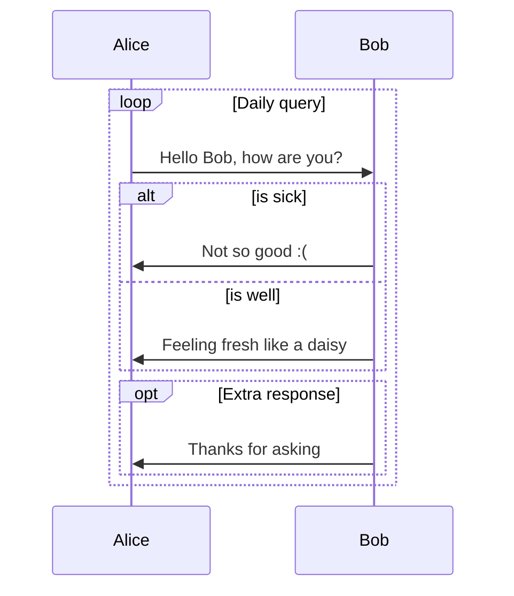

# Bootstrap
```mermaid
graph LR
    A [Square Rect] -- Link text --> B ((Circle))
    A --> C (Round Rect)
    B --> D {Rhombus}
    C --> D
```


# 8.mysql

## handing problems

### MySQL JDBC driver was not found at runtime:

it's easy for Maven but what i used was java EE. So i need 

1. download the `mysql-connector-java-xxx.jar`from the MySQL official website.
2. add it to project classpath:
 lib -> add Framework Support -> Library -> From Disk -> the download file
3. modify project structure and classpath:
  File -> Project Structure -> Modules -> Dependencies -> + -> JARs or directories -> the download file
### throw exception

problem basic functionality of form submission and database insertion is normal, but an attempt to use a closed `PreparedStatement` after the insertion operation is completed result in an exception being thrown.

solution modify index.java.

make sure no further operations are performed on the `PreparedStatement` before closing it. Additionally, it's a good idea to also do some `defensive programming` when closing resources to ensure that even if an exception occurs, the connection is closed properly.
```python
            catch (SQLException e) {
                System.out.println("SQL Exception: " + e.getMessage());
                e.printStackTrace();
            } finally { try { if (ps != null && !ps.isClosed()) {
                        ps.close();
                    } if (conn != null && !conn.isClosed()) {
                        conn.close();
                    }
                } catch (SQLException e) {
                    e.printStackTrace();
                }
```
add this code after `try`